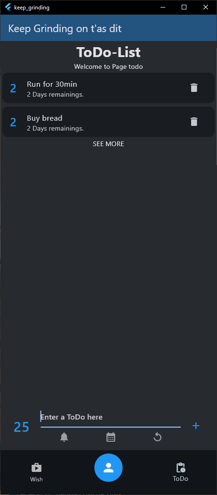

# keep_grinding

## Intro

A Flutter project that gamifies life by awarding points for completing real-life tasks the user set for himself.
With the points earned, the user can reward himself by purchasing items or allowing himself to do certain activities.

Excpected Behavior:
- User create one (or more) "ToDo" on the app like "Send Mail to Mark" or "Do some sport" for n point
- User also create a "Wish" on the app like "I want a galaxy tab, the one that cost 2k$" for n point also
- /!\ "ToDo" **reward** the user points, and "Wish" **cost** the user points
- User complete the task in real life and the check the ToDo's complete box on the app => Gain n point :D
- With theses n points, user can allow himself to buy or do something from his "Wish" list like "drink a shot of vodka at 8 a.m."

## Why using that ?

1) This is an app to **combat procrastination** by focusing on rewards rather than deadline pressure, (inspired by The Good Place, where rewards are eventually forgotten).
2) It also helps **curb impulsive buying** by limiting purchases to points earned through completing a to-do list.

## Getting Started

This project is a starting point for a Flutter application.

A few resources to get you started if this is your first Flutter project:

- [Lab: Write your first Flutter app](https://docs.flutter.dev/get-started/codelab)
- [Cookbook: Useful Flutter samples](https://docs.flutter.dev/cookbook)

For help getting started with Flutter development, view the
[online documentation](https://docs.flutter.dev/), which offers tutorials,
samples, guidance on mobile development, and a full API reference.
